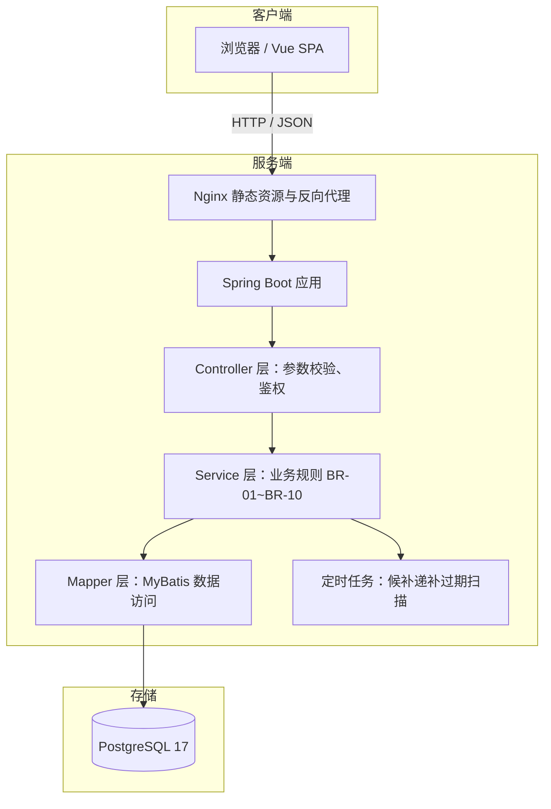
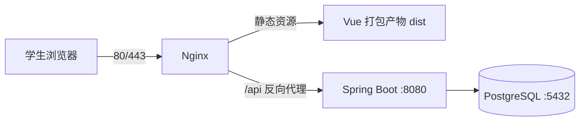
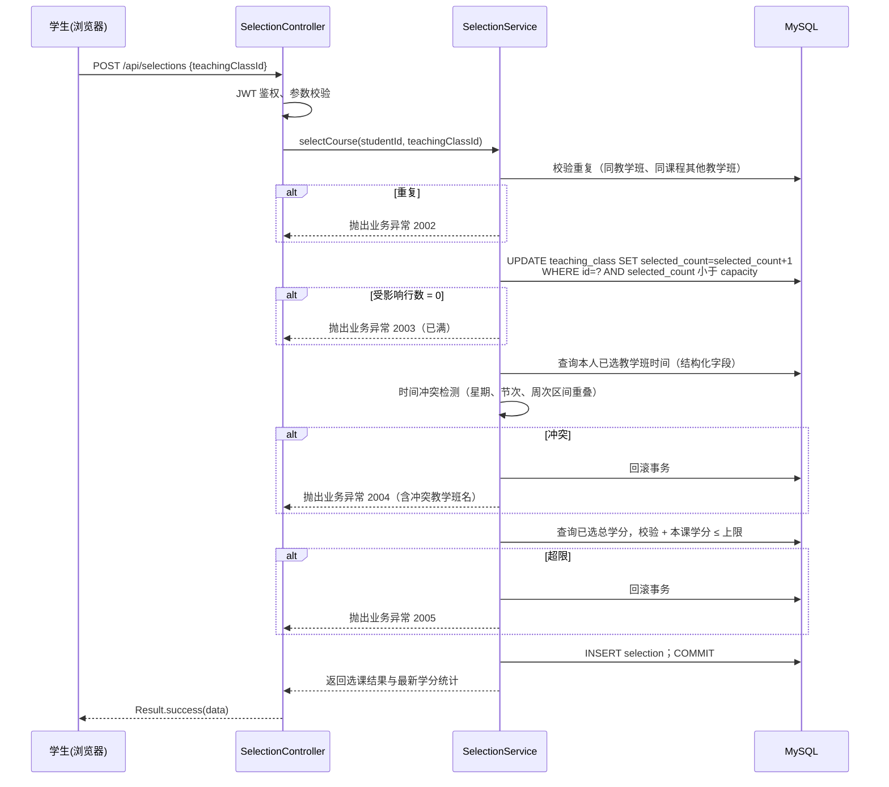
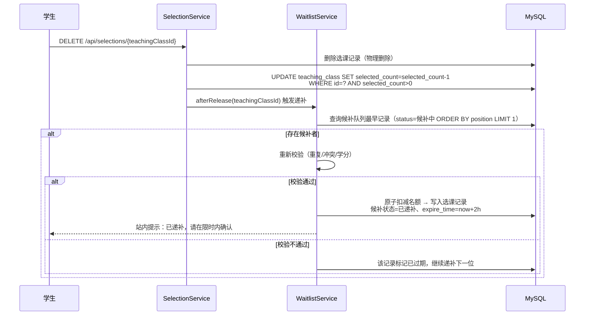

# 选课系统设计文档

| 项目名称 | 学生选课系统               |
| -------- | -------------------------- |
| 文档版本 | V1.1                       |
| 编写日期 | 2026-09-24                 |
| 关联文档 | 《需求分析文档》V1.2       |
| 状态     | 初稿                       |

### 修订记录

| 版本 | 日期       | 修订说明 |
| ---- | ---------- | -------- |
| V1.0 | 2026-09-24 | 初稿     |
| V1.1 | 2026-10-01 | 记录实现差异：数据库由 MySQL 调整为 PostgreSQL，后端升级至 Spring Boot 3.5，新增第 11 章（实现差异说明） |

---

## 1. 引言

### 1.1 编写目的

本文档依据《选课系统需求分析文档》V1.1，给出系统的总体架构、模块划分、数据库结构、接口协议、前后端实现方案与关键机制设计，作为编码实现的直接依据。

### 1.2 设计范围

覆盖需求文档中全部功能需求与业务规则：

- 功能需求：FR-01 ~ FR-14（登录退出、个人资料、课程查询、类别切换、列表与教学班、选课、退课、学分统计、快捷操作与批量退课、高级筛选排序、冲突预标记、余量刷新、意向单、候补）
- 业务规则：BR-01 ~ BR-10
- 数据模型：学生、学院、课程、教学班、选课记录、意向单、候补 7 张表

### 1.3 参考资料

- 《选课系统需求分析文档》V1.1
- 界面参考图：`resource/选课界面.png`

### 1.4 术语与缩写

| 术语/缩写 | 说明                                       |
| --------- | ------------------------------------------ |
| DTO       | 数据传输对象（接收前端请求参数）           |
| VO        | 视图对象（返回给前端的展示数据）           |
| JWT       | JSON Web Token，无状态登录凭证             |
| FIFO      | 先进先出，候补队列的排序原则               |
| 原子扣减  | 通过带条件的 UPDATE 保证名额不超卖         |

---

## 2. 总体设计

### 2.1 系统架构

系统采用**前后端分离**的 B/S 架构：



### 2.2 技术选型

| 层次     | 技术                                        | 选型说明                         |
| -------- | ------------------------------------------- | -------------------------------- |
| 前端     | Vue 3 + Vue Router + Pinia + Axios          | 需求指定 Vue，组合式 API 开发    |
| UI 组件  | 沿用原型自研样式                            | 原设计为 Element Plus，为保持原型视觉未引入组件库（差异见第 11 章） |
| 后端     | Spring Boot 3.5（Spring MVC）               | 原设计 2.7，因本机 JDK 25 环境升级至 3.5（Java 21 兼容） |
| 持久层   | MyBatis                                     | 复杂查询与条件更新直接写 SQL     |
| 数据库   | PostgreSQL 17                               | 原设计为 MySQL 8.0，按评审结论调整（差异见第 11 章） |
| 认证     | JWT（jjwt）+ 登录拦截器                     | 无状态，适配前后端分离           |
| 密码加密 | BCrypt                                      | 加盐哈希，满足非功能安全需求     |
| 构建     | Maven（后端）/ Vite（前端）                 | 主流构建工具                     |

### 2.3 后端分层设计

| 层次          | 职责                                                         | 关键约束                                 |
| ------------- | ------------------------------------------------------------ | ---------------------------------------- |
| Controller    | 接收请求、参数校验、返回统一结果                             | 不写业务逻辑                             |
| Service       | 业务规则实现（校验顺序、事务边界、并发控制）                 | 业务规则集中于此，便于测试               |
| Mapper        | SQL 数据访问                                                 | 复杂查询用 XML，简单 CRUD 用注解         |
| Entity/DTO/VO | 实体、入参、出参分离                                         | 不直接将 Entity 返回前端                 |
| common        | 统一返回体 Result、错误码 ErrorCode、业务异常、全局异常处理  | 所有异常统一转换为 Result                |
| task          | 定时任务（候补递补过期扫描）                                 | 与 Service 复用同一套业务方法            |
| interceptor   | 登录鉴权拦截器                                               | 放行 /api/auth/**                        |

### 2.4 部署架构



- 单机部署：Nginx 托管前端静态文件并反向代理 `/api` 到后端，后端以 jar 方式运行。
- 配置项（`application.yml`）：数据库连接、JWT 密钥与有效期、学分上限（默认 36）、意向单上限（默认 20）、余量刷新间隔（默认 30 秒）、候补确认时限（默认 2 小时）。

---

## 3. 模块设计

### 3.1 模块划分

| 模块         | 对应需求              | 说明                                     |
| ------------ | --------------------- | ---------------------------------------- |
| 认证模块     | FR-01                 | 登录、退出、JWT 签发与校验               |
| 个人资料模块 | FR-02                 | 资料查询与修改                           |
| 课程查询模块 | FR-03、04、05、09、10 | 列表检索、类别、筛选排序、展开与分页     |
| 选课模块     | FR-06、11、12         | 选课校验、冲突检测、余量刷新             |
| 退课模块     | FR-07、09             | 单条退课、批量退课、递补触发             |
| 学分统计模块 | FR-08                 | 已选课程明细与学分汇总                   |
| 意向单模块   | FR-13                 | 收藏、移除、一键选课                     |
| 候补模块     | FR-14                 | 候补申请、FIFO 递补、限时确认、过期扫描  |

### 3.2 选课流程设计（FR-06、BR-01~04）

**校验顺序**：重复选课 → 名额原子扣减 → 时间冲突 → 学分上限，任一步失败整体回滚。



**关键设计点**：

1. **名额不超卖**：`UPDATE ... WHERE selected_count < capacity` 原子条件更新，依赖 InnoDB 行锁，无需乐观锁版本号；受影响行数为 0 即满员（BR-02）。
2. **校验在扣减之后**：先抢占名额再做冲突/学分校验，校验失败事务回滚，名额自动释放，避免"校验通过但名额被抢"的窗口。
3. **事务边界**：Service 方法整体 `@Transactional`，扣减、插入、回滚在同一事务。
4. **防重复提交**：前端按钮 loading 置灰 + 后端唯一索引 `uk_student_class` 兜底。

### 3.3 退课与候补递补流程（FR-07、FR-14、BR-08）



**递补确认与超时**（设计决策：**自动预占 + 超时释放**，保证名额不被浪费）：

1. 递补时即写入选课记录并占用名额，状态标记"已递补"并记录 `expire_time`（默认 2 小时）。
2. 学生确认 → 候补记录写入确认时间，递补生效（对已选记录无需额外落库动作）。
3. 定时任务每分钟扫描：`status=已递补 AND expire_time < now AND confirm_time IS NULL` → 撤销递补（删除选课记录、名额 −1、状态=已过期），并触发下一位递补。
4. 学生主动退出候补：状态=已取消；如已递补则等同退课处理后再顺延（BR-08）。

### 3.4 批量退课设计（FR-09、BR-10）

- 接口接收教学班 ID 列表，**逐条独立事务**执行（复用单条退课逻辑），返回结果明细数组。
- 部分失败不影响已成功项；失败原因随明细返回（如"未选该课"）。
- 批量退课按教学班 ID 升序处理，降低并发场景死锁概率。
- 前端二次确认弹窗展示本次退课门数与学分数（BR-10）。

### 3.5 时间冲突检测设计（BR-03、BR-06）

**数据前提**：教学班时间以结构化字段存储（`day_of_week`、`start_section`、`end_section`、`start_week`、`end_week`），`class_time` 字段仅作展示文本。

**冲突判定公式**（两个教学班 A、B 冲突当且仅当）：

```
A.day_of_week == B.day_of_week
AND A.start_section <= B.end_section AND A.end_section >= B.start_section
AND A.start_week  <= B.end_week     AND A.end_week  >= B.start_week
```

- **服务端**：选课/候补提交时对本人已选教学班逐一比对，冲突则拒绝（BR-03）。
- **前端**：页面加载已选教学班结构化时间（随"我的已选课"接口返回），对列表教学班本地计算并显示"时间冲突"标记、置灰按钮（BR-06）；标记仅提示，以服务端结果为准。
- **限制与扩展**：本期假设一个教学班对应一个时间描述；如需支持一周多次上课，可扩展 `teaching_class_time` 子表（多行时间记录），冲突算法不变。

### 3.6 余量刷新设计（FR-12、BR-07）

- 前端定时器每 30 秒调用余量批量接口（仅返回 `id、selectedCount、remaining` 轻量字段），手动"刷新"按钮即刻调用。
- 页面 `visibilitychange` 隐藏时暂停轮询，可见时恢复，避免无效请求。
- 刷新只更新数据字段，不重建列表组件，保持展开状态、筛选条件与滚动位置（BR-07）。
- 显示"最后刷新时间"。

### 3.7 意向单设计（FR-13、BR-09）

- 收藏/移除仅操作 `wish` 表，不触碰容量；上限 20 条（配置项），超限提示。
- 意向单页展示实时余量、冲突标记、候补状态，通过聚合查询组装 VO。
- "一键选课"逐个调用选课接口：成功项自动从意向单移除（可选），失败项保留并展示失败原因。

### 3.8 候补申请设计（FR-14、BR-08）

- 仅当余量 ≤ 0 时允许申请候补（余量 > 0 时引导学生直接选课）。
- 申请时执行与选课一致的校验（重复、冲突、学分），通过后计算 `position = 当前该教学班候补中最大 position + 1` 并写入。
- "候补中"记录通过生成列唯一约束保证同一学生同一教学班仅一条（见 4.5）。

---

## 4. 数据库设计

### 4.1 设计约定

> 说明：4.2 建表语句为原设计的 MySQL 版本（保留备查）；实际实现采用 PostgreSQL，
> 等价脚本见 `backend/src/main/resources/db/schema.sql`，语法差异见第 11 章。

- 存储引擎 InnoDB，字符集 utf8mb4；主键 `BIGINT` 自增；逻辑外键（不建物理外键，由应用层保证）。
- 时间字段 `DATETIME`，默认 `CURRENT_TIMESTAMP`。
- 金额学分用 `DECIMAL`；状态类字段用 `TINYINT` 字典值（相较需求文档的 varchar，属设计细化）。

### 4.2 建表语句

```sql
-- 学院表
CREATE TABLE college (
    id   BIGINT PRIMARY KEY AUTO_INCREMENT,
    name VARCHAR(50) NOT NULL UNIQUE COMMENT '学院名称'
) ENGINE = InnoDB DEFAULT CHARSET = utf8mb4 COMMENT ='学院表';

-- 学生表
CREATE TABLE student (
    id         BIGINT PRIMARY KEY AUTO_INCREMENT,
    student_no VARCHAR(20)  NOT NULL UNIQUE COMMENT '学号',
    password   VARCHAR(100) NOT NULL COMMENT 'BCrypt 密码哈希',
    name       VARCHAR(50)  NOT NULL COMMENT '姓名',
    gender     VARCHAR(4)   COMMENT '性别',
    major      VARCHAR(50)  COMMENT '专业',
    grade      VARCHAR(10)  COMMENT '年级',
    phone      VARCHAR(20)  COMMENT '联系电话',
    email      VARCHAR(50)  COMMENT '邮箱',
    college_id BIGINT       COMMENT '所属学院',
    KEY idx_college (college_id)
) ENGINE = InnoDB DEFAULT CHARSET = utf8mb4 COMMENT ='学生表';

-- 课程表
CREATE TABLE course (
    id         BIGINT PRIMARY KEY AUTO_INCREMENT,
    course_no  VARCHAR(20)  NOT NULL UNIQUE COMMENT '课程编号',
    name       VARCHAR(100) NOT NULL COMMENT '课程名称',
    credit     DECIMAL(3,1) NOT NULL COMMENT '学分',
    category   VARCHAR(20)  NOT NULL COMMENT '类别：主修/通识选修/体育/英语',
    college_id BIGINT       COMMENT '开课学院',
    KEY idx_category (category),
    KEY idx_college (college_id)
) ENGINE = InnoDB DEFAULT CHARSET = utf8mb4 COMMENT ='课程表';

-- 教学班表（时间为结构化字段，class_time 仅展示）
CREATE TABLE teaching_class (
    id            BIGINT PRIMARY KEY AUTO_INCREMENT,
    course_id     BIGINT       NOT NULL COMMENT '所属课程',
    class_name    VARCHAR(100) NOT NULL COMMENT '教学班名称',
    teacher       VARCHAR(50)  COMMENT '任课教师',
    class_time    VARCHAR(100) COMMENT '上课时间展示文本',
    classroom     VARCHAR(100) COMMENT '上课地点',
    day_of_week   TINYINT      NOT NULL COMMENT '星期：1-7',
    start_section TINYINT      NOT NULL COMMENT '开始节次',
    end_section   TINYINT      NOT NULL COMMENT '结束节次',
    start_week    TINYINT      NOT NULL COMMENT '开始周',
    end_week      TINYINT      NOT NULL COMMENT '结束周',
    capacity      INT          NOT NULL DEFAULT 0 COMMENT '容量',
    selected_count INT         NOT NULL DEFAULT 0 COMMENT '已选人数',
    KEY idx_course (course_id),
    KEY idx_teacher (teacher)
) ENGINE = InnoDB DEFAULT CHARSET = utf8mb4 COMMENT ='教学班表';

-- 选课记录表（只保留有效记录，退课物理删除）
CREATE TABLE selection (
    id                BIGINT PRIMARY KEY AUTO_INCREMENT,
    student_id        BIGINT   NOT NULL COMMENT '学生',
    teaching_class_id BIGINT   NOT NULL COMMENT '教学班',
    select_time       DATETIME NOT NULL DEFAULT CURRENT_TIMESTAMP COMMENT '选课时间',
    status            TINYINT  NOT NULL DEFAULT 1 COMMENT '1=已选',
    UNIQUE KEY uk_student_class (student_id, teaching_class_id),
    KEY idx_class (teaching_class_id)
) ENGINE = InnoDB DEFAULT CHARSET = utf8mb4 COMMENT ='选课记录表';

-- 意向单表
CREATE TABLE wish (
    id                BIGINT PRIMARY KEY AUTO_INCREMENT,
    student_id        BIGINT   NOT NULL COMMENT '学生',
    teaching_class_id BIGINT   NOT NULL COMMENT '收藏的教学班',
    create_time       DATETIME NOT NULL DEFAULT CURRENT_TIMESTAMP COMMENT '收藏时间',
    UNIQUE KEY uk_student_class (student_id, teaching_class_id)
) ENGINE = InnoDB DEFAULT CHARSET = utf8mb4 COMMENT ='意向单表';

-- 候补表（waiting_flag 生成列：仅"候补中"参与唯一约束）
CREATE TABLE waitlist (
    id                BIGINT PRIMARY KEY AUTO_INCREMENT,
    student_id        BIGINT   NOT NULL COMMENT '学生',
    teaching_class_id BIGINT   NOT NULL COMMENT '候补的教学班',
    position          INT      NOT NULL COMMENT '候补序号（FIFO）',
    status            TINYINT  NOT NULL DEFAULT 1 COMMENT '1=候补中 2=已递补 3=已取消 4=已过期',
    create_time       DATETIME NOT NULL DEFAULT CURRENT_TIMESTAMP COMMENT '申请时间',
    expire_time       DATETIME COMMENT '递补确认截止时间',
    confirm_time      DATETIME COMMENT '确认时间',
    waiting_flag      TINYINT GENERATED ALWAYS AS (IF(status = 1, 1, NULL)) STORED,
    UNIQUE KEY uk_waiting (student_id, teaching_class_id, waiting_flag),
    KEY idx_class_status (teaching_class_id, status, position)
) ENGINE = InnoDB DEFAULT CHARSET = utf8mb4 COMMENT ='候补表';
```

### 4.3 与需求数据字典的差异说明

| 项                 | 需求文档       | 设计文档                   | 原因                                       |
| ------------------ | -------------- | -------------------------- | ------------------------------------------ |
| selection 记录     | status 已选/已退 | 只存有效记录，退课物理删除 | 与 FR-07"删除选课记录"一致；唯一索引简单有效 |
| teaching_class 时间 | class_time 文本 | 增加 5 个结构化字段        | 时间冲突检测需要（BR-03）                  |
| 状态字段           | varchar 中文    | TINYINT 字典值             | 索引效率与规范                              |
| waitlist           | status varchar  | status TINYINT + 生成列    | "候补中"唯一约束（BR-08）                  |

### 4.4 核心 SQL 设计

```sql
-- 名额原子扣减（防超卖，BR-02）
UPDATE teaching_class
SET selected_count = selected_count + 1
WHERE id = #{classId} AND selected_count < capacity;

-- 已选学分统计（BR-01）
SELECT IFNULL(SUM(c.credit), 0)
FROM selection s
JOIN teaching_class tc ON tc.id = s.teaching_class_id
JOIN course c ON c.id = tc.course_id
WHERE s.student_id = #{studentId};

-- 同课程互斥校验（BR-04）
SELECT COUNT(*)
FROM selection s
JOIN teaching_class tc ON tc.id = s.teaching_class_id
WHERE s.student_id = #{studentId}
  AND tc.course_id = #{courseId};

-- 候补队列头（BR-08）
SELECT * FROM waitlist
WHERE teaching_class_id = #{classId} AND status = 1
ORDER BY position ASC LIMIT 1;
```

### 4.5 索引与约束设计说明

| 表/索引                          | 作用                                       |
| -------------------------------- | ------------------------------------------ |
| `uk_student_class`（selection）  | 防重复选课（BR-04）                        |
| `uk_student_class`（wish）       | 防重复收藏（BR-09）                        |
| `uk_waiting`（waitlist 生成列）  | 仅"候补中"不可重复，历史记录可多条（BR-08） |
| `idx_class_status`（waitlist）   | 递补时快速取队列头                         |
| `idx_category`（course）         | 类别 Tab 查询（FR-04）                     |
| `idx_teacher`（teaching_class）  | 教师筛选（FR-10）                          |

---

## 5. 接口设计

### 5.1 通用规范

- 基础路径 `/api`；请求/响应均为 JSON（UTF-8）。
- 统一响应体：

```json
{ "code": 0, "message": "success", "data": {} }
```

- 登录后请求头携带 `Authorization: Bearer <token>`。
- 分页参数：`page`（从 1 开始）、`size`（默认 10）；分页响应：`{ total, page, size, list }`。

### 5.2 错误码定义

| code | 含义                 | 处理建议                 |
| ---- | -------------------- | ------------------------ |
| 0    | 成功                 | -                        |
| 1001 | 未登录 / 凭证过期    | 跳转登录页               |
| 1002 | 学号或密码错误       | 提示用户                 |
| 2001 | 教学班不存在         | 刷新列表                 |
| 2002 | 重复选课             | 提示已选同教学班/同课程  |
| 2003 | 教学班已满           | 引导加入候补（FR-14）    |
| 2004 | 时间冲突             | 返回冲突教学班名         |
| 2005 | 超出学分上限         | 展示当前已选学分         |
| 2006 | 未选该教学班（退课） | 刷新已选列表             |
| 3001 | 候补重复             | 提示已在候补队列         |
| 3002 | 候补不存在/已失效    | 刷新候补列表             |
| 4001 | 意向单数量超限       | 提示上限 20 条           |
| 5000 | 系统异常             | 稍后重试                 |

### 5.3 接口清单

| 模块     | 方法   | 路径                              | 说明                             | 对应需求        |
| -------- | ------ | --------------------------------- | -------------------------------- | --------------- |
| 认证     | POST   | /api/auth/login                   | 登录，返回 token 与用户信息      | FR-01           |
| 认证     | POST   | /api/auth/logout                  | 退出（前端清除 token）           | FR-01           |
| 资料     | GET    | /api/student/profile              | 查询个人资料                     | FR-02           |
| 资料     | PUT    | /api/student/profile              | 修改电话、邮箱                   | FR-02           |
| 课程     | GET    | /api/courses                      | 课程分页列表（搜索/筛选/排序）   | FR-03/04/10     |
| 课程     | GET    | /api/courses/{courseId}/classes   | 某课程下教学班列表               | FR-05           |
| 课程     | GET    | /api/classes/availability         | 批量余量刷新（轻量）             | FR-12           |
| 选课     | POST   | /api/selections                   | 选课                             | FR-06           |
| 选课     | DELETE | /api/selections/{teachingClassId} | 退课                             | FR-07           |
| 选课     | POST   | /api/selections/batch-cancel      | 批量退课                         | FR-09           |
| 选课     | GET    | /api/selections                   | 已选课程明细 + 学分统计 + 候补状态 | FR-08         |
| 意向单   | GET    | /api/wishes                       | 意向单列表（含余量/冲突/候补）   | FR-13           |
| 意向单   | POST   | /api/wishes                       | 加入意向单                       | FR-13           |
| 意向单   | DELETE | /api/wishes/{teachingClassId}     | 移除收藏                         | FR-13           |
| 候补     | POST   | /api/waitlist                     | 申请候补                         | FR-14           |
| 候补     | GET    | /api/waitlist                     | 我的候补列表与状态               | FR-14           |
| 候补     | DELETE | /api/waitlist/{teachingClassId}   | 退出候补                         | FR-14           |
| 候补     | POST   | /api/waitlist/{teachingClassId}/confirm | 确认递补                   | FR-14           |

### 5.4 关键接口示例

**课程列表** `GET /api/courses?keyword=语文&category=主修课程&teacher=张&dayOfWeek=2&onlyAvailable=true&onlyNoConflict=true&sortBy=remaining&page=1&size=10`

响应 `data`：

```json
{
  "total": 1,
  "page": 1,
  "size": 10,
  "list": [
    {
      "courseId": 1,
      "courseNo": "U0161001",
      "name": "大学语文",
      "credit": 4.0,
      "category": "主修课程",
      "classCount": 7,
      "selected": true,
      "classes": [
        {
          "classId": 11,
          "className": "大学语文01班",
          "teacher": "李老师",
          "classTime": "周二 3-4 节 1-16 周",
          "classroom": "一教 101",
          "capacity": 50,
          "selectedCount": 48,
          "remaining": 2,
          "conflict": false,
          "selected": true,
          "waiting": false
        }
      ]
    }
  ]
}
```

**选课** `POST /api/selections`，请求 `{ "teachingClassId": 11 }`：

- 成功：`{ "code": 0, "data": { "selectedCredit": 8.0, "selectedCount": 2 } }`
- 失败：`{ "code": 2004, "message": "与已选课程《大学英语》时间冲突" }`

**批量退课** `POST /api/selections/batch-cancel`，请求 `{ "teachingClassIds": [11, 12] }`：

```json
{
  "code": 0,
  "data": {
    "results": [
      { "teachingClassId": 11, "success": true },
      { "teachingClassId": 12, "success": false, "reason": "未选该教学班" }
    ]
  }
}
```

**加入候补** `POST /api/waitlist`，请求 `{ "teachingClassId": 21 }`：

- 成功：`{ "code": 0, "data": { "position": 3 } }`
- 失败：`{ "code": 3001, "message": "已在候补队列中" }`

---

## 6. 前端设计

### 6.1 工程结构

```
frontend/
├─ src/
│  ├─ api/            # 接口封装：auth.js、course.js、selection.js、wish.js、waitlist.js
│  ├─ assets/
│  ├─ components/     # CourseList、TeachingClassRow、FilterBar、SortBar、
│  │                  # LegendBar、CreditSummary、SideNav、PaginationBar
│  ├─ views/          # LoginView、CourseSelectView、MyCoursesView、WishlistView、ProfileView
│  ├─ store/          # Pinia：user（token/资料）、selection（已选/学分/冲突缓存）、filter
│  ├─ router/         # 路由与登录守卫
│  ├─ utils/          # request.js（Axios 封装）、conflict.js（冲突预标记）
│  └─ App.vue / main.js
└─ vite.config.js
```

### 6.2 路由设计

| 路由           | 页面           | 登录守卫 | 对应需求        |
| -------------- | -------------- | -------- | --------------- |
| /login         | 登录页         | 否       | FR-01           |
| /course-select | 自主选课页     | 是       | FR-03~06、09~14 |
| /my-courses    | 已选课信息页   | 是       | FR-08、09、14   |
| /wishlist      | 意向单页       | 是       | FR-13           |
| /profile       | 个人资料页     | 是       | FR-02           |

### 6.3 关键交互设计

| 交互点         | 设计                                                                 |
| -------------- | -------------------------------------------------------------------- |
| 选课按钮防连点 | 点击后立即 loading 置灰，接口返回后恢复（配合后端唯一索引兜底）      |
| 冲突预标记     | `selection` store 缓存已选教学班结构化时间，`conflict.js` 本地计算，列表渲染时标记并置灰按钮（BR-06） |
| 余量轮询       | 30 秒定时 + 手动刷新；`visibilitychange` 暂停/恢复；仅更新余量字段，不重建列表（BR-07） |
| 全部展开/收起  | 单一 `expandedAll` 状态控制所有课程行展开状态，替代逐个点击（FR-09）  |
| 批量退课       | 已选教学班行带复选框，底部操作栏显示已勾选数与总学分，二次确认弹窗（BR-10） |
| 筛选条件标签   | filter store 统一维护条件集合，渲染为可删除标签，变更即触发查询（FR-03） |
| 一键选课       | 意向单页逐条调用选课接口，展示每条结果，成功后从列表移除（FR-13）    |

### 6.4 Axios 封装

- 请求拦截：注入 `Authorization` 头。
- 响应拦截：`code === 0` 返回 `data`；`code === 1001` 清除登录态并跳转登录页；其他错误统一 `ElMessage` 提示。

---

## 7. 后端设计

### 7.1 包结构

```
backend/src/main/java/com/example/courseselect/
├─ config/        # WebMvcConfig（拦截器注册）、TaskConfig（@EnableScheduling）
├─ controller/    # AuthController、ProfileController、CourseController、
│                 # SelectionController、WishlistController、WaitlistController
├─ service/       # 业务接口与实现（CourseService、SelectionService、WaitlistService 等）
├─ mapper/        # MyBatis Mapper 接口 + resources/mapper/*.xml
├─ entity/        # 与表一一对应
├─ dto/           # LoginDTO、SelectDTO、BatchCancelDTO、CourseQueryDTO 等
├─ vo/            # CourseVO、TeachingClassVO、SelectionVO、WishVO、WaitlistVO
├─ common/        # Result、ErrorCode、BusinessException、GlobalExceptionHandler
├─ interceptor/   # AuthInterceptor（JWT 校验）
├─ task/          # WaitlistExpireTask（候补递补过期扫描）
└─ util/          # JwtUtil、TimeConflictUtil
```

### 7.2 核心类职责

| 类                  | 职责                                                         |
| ------------------- | ------------------------------------------------------------ |
| SelectionService    | 选课、退课、批量退课；事务边界；触发递补（BR-01~04、10）     |
| WaitlistService     | 候补申请/退出/确认、FIFO 递补、过期处理（BR-08）             |
| CourseService       | 课程检索（关键词/类别/筛选/排序）、余量批量查询（FR-03~05、10、12） |
| WishlistService     | 收藏、移除、上限校验、意向单聚合视图（FR-13、BR-09）         |
| TimeConflictUtil    | 纯函数：两教学班时间区间重叠判定（BR-03）                    |
| GlobalExceptionHandler | 业务异常 → Result；系统异常 → 5000 并记录日志             |
| WaitlistExpireTask  | `@Scheduled(cron = "0 * * * * ?")` 每分钟扫描过期递补并顺延   |

### 7.3 事务与并发设计

| 场景         | 策略                                                                 |
| ------------ | -------------------------------------------------------------------- |
| 选课         | 单事务：原子扣减 → 冲突 → 学分 → 插入记录；行锁天然串行化同一教学班竞争 |
| 单条退课     | 单事务：删除记录 + 名额递减（`WHERE selected_count > 0` 防负值）      |
| 批量退课     | 逐条独立事务；按 ID 升序降低死锁风险（BR-10）                        |
| 候补递补     | 单事务：取队列头 → 校验 → 原子扣减 → 写入递补；同一教学班递补串行     |
| 防重复提交   | 前端 loading + 服务端唯一索引；唯一索引冲突转换为业务错误码 2002      |

---

## 8. 安全设计

| 项         | 方案                                                                 |
| ---------- | -------------------------------------------------------------------- |
| 密码存储   | BCrypt 加盐哈希，不可逆                                               |
| 身份认证   | JWT 签发（含学生 ID、有效期 2 小时）；AuthInterceptor 校验签名与过期  |
| 越权防护   | 所有涉及学生数据的 SQL 均以当前登录学生 ID 为条件，不信任前端传入     |
| SQL 注入   | MyBatis `#{}` 预编译占位，禁止 `${}` 拼接用户输入                    |
| XSS        | Vue 默认转义；渲染文本不使用 `v-html`                                 |
| 输入校验   | Controller 层 Bean Validation（@NotNull、@Min 等）+ 业务层二次校验    |
| 异常信息   | 对外仅输出业务错误码与友好文案，堆栈仅记日志                          |

---

## 9. 需求追溯矩阵

| 需求       | 设计章节                       | 关键接口/类                          |
| ---------- | ------------------------------ | ------------------------------------ |
| FR-01      | 3.1、8                         | /api/auth/*、AuthInterceptor         |
| FR-02      | 3.1                            | /api/student/profile                 |
| FR-03~05   | 3.1、6.3                       | /api/courses、/api/courses/{id}/classes |
| FR-06      | 3.2                            | POST /api/selections                 |
| FR-07      | 3.3                            | DELETE /api/selections/{id}          |
| FR-08      | 3.1                            | GET /api/selections                  |
| FR-09      | 3.4、6.3                       | /api/selections/batch-cancel         |
| FR-10      | 3.1、6.3                       | /api/courses（筛选排序参数）         |
| FR-11      | 3.5                            | conflict.js、TimeConflictUtil        |
| FR-12      | 3.6                            | /api/classes/availability            |
| FR-13      | 3.7                            | /api/wishes                          |
| FR-14      | 3.3、3.8                       | /api/waitlist、WaitlistExpireTask    |
| BR-01~02   | 3.2、4.4                       | 原子扣减 SQL、学分统计 SQL           |
| BR-03      | 3.5                            | TimeConflictUtil                     |
| BR-04      | 4.5                            | uk_student_class、同课程互斥 SQL     |
| BR-05      | 5.3                            | 课程列表查询参数                     |
| BR-06~10   | 3.3~3.8                        | 见对应章节                           |

---

## 10. 设计决策记录

| 编号 | 决策                                     | 理由                                                     |
| ---- | ---------------------------------------- | -------------------------------------------------------- |
| D-01 | 名额控制采用原子条件 UPDATE，不引入 Redis | 单机 100 并发下 MySQL 行锁足够；KISS，减少部署依赖        |
| D-02 | 退课物理删除选课记录                     | 与 FR-07 表述一致，唯一索引即可保证"已选唯一"            |
| D-03 | 候补采取"自动预占 + 2 小时超时释放"      | 避免通知-确认窗口内名额空置；超时由定时任务兜底          |
| D-04 | 时间冲突使用结构化字段而非解析文本       | 计算简单可靠，避免文本解析歧义                           |
| D-05 | 余量刷新采用轮询而非 WebSocket           | 30 秒延迟满足 BR-07；实现简单                            |
| D-06 | 批量退课逐条独立事务                     | 满足 BR-10"部分失败不影响已成功项"                       |

---

## 11. 实现差异说明（V1.1）

实际实现与本文档原设计的差异如下，业务逻辑与接口契约保持不变：

| 项 | 原设计 | 实际实现 | 说明 |
| --- | --- | --- | --- |
| 数据库 | MySQL 8.0 | **PostgreSQL 17** | 建表语句等价改写：`AUTO_INCREMENT` → `GENERATED BY DEFAULT AS IDENTITY`；`TINYINT` → `SMALLINT`；`DATETIME` → `TIMESTAMP`；生成列 `STORED` 语法；`INSERT IGNORE` → `ON CONFLICT DO NOTHING`；驱动 `org.postgresql`，端口 5432 |
| 后端版本 | Spring Boot 2.7 | **Spring Boot 3.5** | 运行环境 JDK 21+（本机 JDK 25 已验证），依赖 `mybatis-spring-boot-starter 3.0.5`、`jjwt 0.12` |
| UI 组件库 | Element Plus | **沿用原型自研样式** | 为保持原型视觉与交互一致，未引入组件库；样式由原型迁移 |
| 前后端工程 | 单仓设计 | `frontend/` 与 `backend/` **两个可独立编译运行的项目** | 前端开发通过 Vite 代理 `/api`；生产由 Nginx 托管 dist 并反代后端 |
| 数据初始化 | 未定义 | 由 `backend/tools/generate-seed.mjs` 从两个 txt 生成 `data.sql`，应用启动时幂等导入 | 学生初始密码统一 `123456`（BCrypt） |

### 11.1 接口实现状态

第 5 章接口清单已全部实现（登录、课程查询、余量刷新、选退课、批量退课、已选明细、意向单、候补）；分页参数暂未启用（数据量小），候选补选、候补递补定时任务列入后续版本。
