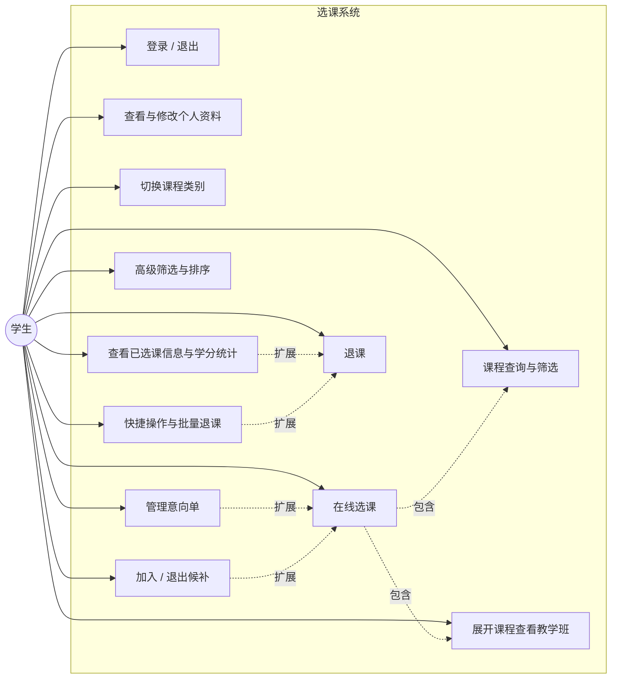
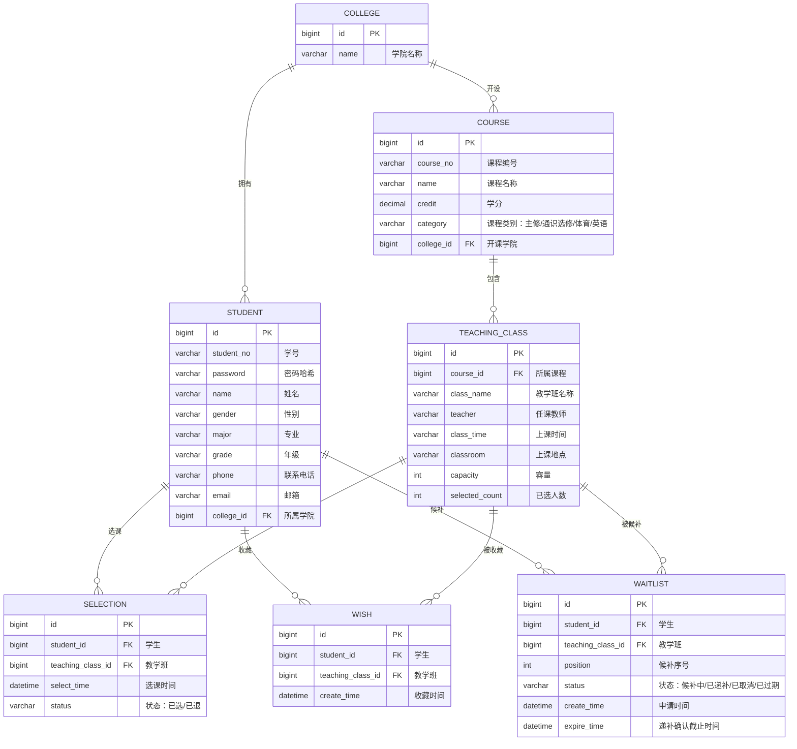

# 选课系统需求分析文档

| 项目名称 | 学生选课系统 |
| -------- | ------------ |
| 文档版本 | V1.1 |
| 编写日期 | 2026-09-24 |
| 状态     | 初稿         |

### 修订记录

| 版本 | 日期       | 修订说明                                                                 |
| ---- | ---------- | ------------------------------------------------------------------------ |
| V1.0 | 2026-09-24 | 初稿                                                                     |
| V1.1 | 2026-09-24 | 新增快捷操作与批量退课、高级筛选排序、冲突预标记、余量刷新、意向单、候补排队（FR-09~FR-14、BR-06~BR-10） |

---

## 1. 引言

### 1.1 编写目的

本文档面向项目开发人员、测试人员与指导教师，明确学生选课系统的功能范围、业务规则、数据模型与界面要求，作为后续系统设计、编码与测试的依据。

### 1.2 项目背景

学生选课是高校教务管理的核心业务之一。传统线下选课效率低、信息不透明。本系统旨在提供一个在线选课平台，学生登录后可查询课程、查看教学班余量并完成选课/退课，实时掌握自己的选课结果与学分情况。

### 1.3 术语定义

| 术语       | 说明                                                         |
| ---------- | ------------------------------------------------------------ |
| 课程       | 教学计划中的一门课，如"大学语文"，包含课程编号、名称、学分等 |
| 教学班     | 课程的具体开课单位，一门课程可开设多个教学班，拥有独立的上课时间、地点、教师、容量 |
| 学分       | 课程对应的学分数值，选课总学分受上下限约束                   |
| 容量       | 一个教学班允许选课的人数上限                                 |
| 余量       | 余量 = 容量 − 已选人数，余量为 0 时不可再选                  |
| 选课状态   | 学生对某课程/教学班的当前状态：已选 / 未选                   |
| 时间冲突   | 学生已选教学班与新选教学班存在相同上课时间段                 |
| 意向单     | 学生收藏的备选教学班列表，不占用容量、不锁定名额             |
| 候补       | 教学班满员后学生按先后顺序排队，等待名额释放后递补的机制     |

### 1.4 参考资料

- 界面参考图：`resource/选课界面.png`（学生端"自主选课"界面）
- 参考网站：https://jwgl.usst.edu.cn/jwglxt/xsxk/zzxkyzb_cxZzxkYzbIndex.html?gnmkdm=N253512&layout=default （正方教务系统，需登录，仅作来源参考）

---

## 2. 项目概述

### 2.1 系统目标

实现一个面向学生的在线选课系统，支持课程查询、教学班选择、选课与退课、学分统计等核心功能，保证选课过程数据准确、规则严格、操作便捷。

### 2.2 用户角色

本系统仅包含**学生**一种角色：

| 角色 | 说明                               |
| ---- | ---------------------------------- |
| 学生 | 登录系统后进行课程查询、选课与退课 |

### 2.3 技术栈

| 层次     | 技术选型                    |
| -------- | --------------------------- |
| 前端     | Vue                         |
| 后端     | Spring Boot                 |
| 数据库   | MySQL                       |
| 接口风格 | RESTful API，JSON 数据交互  |

### 2.4 运行环境

- 服务端：JDK 8+、Spring Boot 运行环境、MySQL 5.7+/8.0
- 客户端：Chrome / Edge 等现代浏览器

---

## 3. 功能需求

### 3.1 用例图



### 3.2 功能清单

| 编号  | 功能名称             | 优先级 | 说明                                     |
| ----- | -------------------- | ------ | ---------------------------------------- |
| FR-01 | 用户登录/退出        | 高     | 学号+密码登录，退出清空会话              |
| FR-02 | 个人资料             | 中     | 查看与修改个人基本信息                   |
| FR-03 | 课程查询与筛选       | 高     | 关键词搜索、条件筛选、条件标签删除、重置 |
| FR-04 | 课程类别切换         | 高     | 主修课程 / 通识选修课 / 体育分项 / 英语分项 |
| FR-05 | 课程列表与教学班展开 | 高     | 手风琴式列表，展开显示教学班             |
| FR-06 | 在线选课             | 高     | 选择具体教学班完成选课                   |
| FR-07 | 退课                 | 高     | 对已选教学班退课                         |
| FR-08 | 已选课信息与学分统计 | 高     | 查看已选课程，实时统计已选学分           |
| FR-09 | 快捷操作与批量退课   | 中     | 全部展开/收起教学班，勾选多个已选教学班批量退课 |
| FR-10 | 高级筛选与排序       | 中     | 按教师、时间、余量等排序与过滤，支持"仅看无冲突""仅看有余量" |
| FR-11 | 时间冲突预标记       | 高     | 列表提前标记与已选时间冲突的教学班并置灰选课按钮 |
| FR-12 | 余量实时刷新         | 高     | 手动 + 定时刷新教学班余量，显示最后刷新时间 |
| FR-13 | 意向单（备选课程）   | 高     | 收藏教学班备选，一键发起选课，不占容量   |
| FR-14 | 候补排队             | 高     | 满员教学班可加入候补，按序递补，限时确认 |

### 3.3 功能详细描述

#### FR-01 用户登录/退出

- 学生输入学号与密码登录，校验通过后进入选课首页。
- 登录失败时提示"学号或密码错误"。
- 未登录访问受保护页面时跳转登录页。
- 提供"退出登录"入口，退出后清空登录状态。

#### FR-02 个人资料

- 展示学号、姓名、性别、学院、专业、年级等基本信息。
- 支持修改联系电话、邮箱等可编辑字段。

#### FR-03 课程查询与筛选

- 搜索框支持按**课程号、课程名称、教学班名称**模糊查询。
- 提供"查询"与"重置"按钮：重置恢复默认列表与查询条件。
- 支持筛选条件（如"有剩余量"），已选条件以标签形式展示在列表上方，点击标签上的删除按钮可移除该条件并刷新列表。
- 提供"展开/收起"按钮，展开更多筛选条件。

#### FR-04 课程类别切换

- 列表上方提供类别 Tab：**主修课程、通识选修课、体育分项、英语分项**。
- 切换 Tab 后按对应类别加载课程列表，当前 Tab 高亮显示。

#### FR-05 课程列表与教学班展开

- 课程以手风琴列表形式展示，每行显示：
  - 课程代码与课程名称，如"（U0161001）大学语文"
  - 学分，如"4 学分"
  - 教学班个数，如"教学班个数：7"
  - 状态：已选 / 未选
- 点击行右侧箭头展开该课程下的教学班列表，再次点击收起。
- 教学班信息包含：教学班名称、任课教师、上课时间、上课地点、容量、已选人数、余量、选课/退课按钮。
- 列表按状态着色区分：已选（绿色底）、未选（蓝色/白色底）；界面提供图例说明"未选 / 已选"。

#### FR-06 在线选课

- 学生在展开的教学班中选择目标教学班，点击"选课"。
- 系统依次校验：是否重复选课 → 教学班余量 → 上课时间冲突 → 选课学分上下限。
- 校验全部通过后写入选课记录，教学班已选人数 +1，课程行状态更新为"已选"，页面学分统计刷新。
- 任一校验失败，给出明确失败原因提示。

#### FR-07 退课

- 学生可对状态为"已选"的教学班点击"退课"。
- 退课成功后删除选课记录，教学班已选人数 −1，状态恢复为"未选"，学分统计刷新。
- 退课前给出确认提示。

#### FR-08 已选课信息与学分统计

- 页面信息条实时显示：**已选学分**、**已选课程数**。
- 右侧竖排栏提供"选课信息 / 已选课信息"入口，可查看已选课程明细列表（课程、教学班、学分、教师、时间地点）。

#### FR-09 快捷操作与批量退课

- 课程列表提供"全部展开 / 全部收起"按钮，一键展开或收起所有课程的教学班，避免逐行点击。
- 已选课程支持勾选多个教学班后"批量退课"，退课前二次确认，提示本次退课门数与学分数。
- 批量退课逐条执行并返回结果明细（成功 / 失败原因），部分失败不影响已成功项（见 BR-10）。

#### FR-10 高级筛选与排序

- 课程列表支持排序：按余量（多→少）、学分、课程编号排序；教学班支持按任课教师、上课时间排序。
- 支持高级筛选：按任课教师、上课时间（星期几 / 节次）过滤，并提供"仅看无时间冲突""仅看有余量"快捷条件。
- 筛选与排序条件与关键词、类别 Tab、已选条件标签叠加生效（见 BR-05）。

#### FR-11 时间冲突预标记

- 课程列表与教学班展开区实时比对已选教学班的上课时间，对存在冲突的教学班显示"时间冲突"标记，并置灰其选课 / 候补按钮。
- 冲突预标记仅作提示，选课最终以提交时服务端校验为准（见 BR-03、BR-06）。

#### FR-12 余量实时刷新

- 页面提供"刷新"按钮，并支持定时自动刷新（默认每 30 秒），更新教学班已选人数与余量。
- 页面显示"最后刷新时间"，刷新过程不打断当前展开状态、已输入查询条件与滚动位置。
- 余量展示允许短暂延迟，选课结果以服务端实时校验为准（见 BR-07）。

#### FR-13 意向单（备选课程）

- 学生可将感兴趣的教学班加入意向单（教学班行提供"收藏"按钮），也可随时移除。
- 意向单页面展示已收藏教学班的实时余量、是否与已选时间冲突、候补状态，并提供"一键选课"逐个发起选课。
- 意向单不占用教学班容量、不锁定名额；从意向单发起的选课仍需通过全部校验（见 BR-09）。
- 意向单收藏数量上限为 20 个教学班（可配置）。

#### FR-14 候补排队

- 教学班满员时，原"选课"按钮变为"加入候补"，学生可申请候补。
- 申请候补需通过重复选课、时间冲突、学分上限校验，通过后按申请顺序生成候补序号。
- 当有学生退课释放名额时，系统按候补顺序自动递补或通知最早候补者，候补者需在限时内确认（默认 2 小时），超时视为放弃并顺延下一位。
- 学生可查看自己的候补状态（候补中 / 已递补 / 已取消 / 已过期），并可主动退出候补（见 BR-08）。

---

## 4. 业务规则

### BR-01 学分上下限校验

- 系统设定选课总学分上限与下限（示例：最低 0 学分，最高 100 学分）。
- 选课时校验：**当前已选学分 + 拟选课程学分 ≤ 学分上限**，超出则拒绝选课并提示。
- 学分下限用于学期结束时的选课结果检查（低于下限给出提醒），不阻塞单次选课操作。

### BR-02 容量与余量控制

- 余量 = 教学班容量 − 已选人数。
- 余量 ≤ 0 时，选课按钮置灰不可点击，提示"该教学班已满"。
- 选课成功后教学班已选人数实时 +1；退课后实时 −1。
- 并发选课场景下，教学班已选人数不得超过容量（需在服务端做并发控制）。

### BR-03 上课时间冲突检测

- 每个教学班的上课时间由"星期几 + 第几节~第几节 + 周次范围"描述。
- 学生选择新教学班时，系统比对其上课时间与本人已选全部教学班的上课时间。
- 若存在重叠时间段，拒绝选课并提示冲突的教学班。

### BR-04 禁止重复选课

- 同一学生不可重复选择同一教学班。
- 同一课程的不同教学班之间互斥，学生只能选择其中一个教学班。

### BR-05 查询条件组合

- 多个筛选条件为"与"关系组合生效。
- 关键词搜索与类别 Tab、筛选条件可叠加使用。

### BR-06 时间冲突预标记

- 前端实时计算教学班与本人已选教学班的时间冲突，冲突教学班显示标记并置灰选课 / 候补按钮。
- 预标记为辅助提示，提交时仍以服务端校验结果为准，避免因数据过期导致误判。

### BR-07 余量刷新与数据一致性

- 余量展示允许秒级延迟；定时刷新间隔默认 30 秒，可由系统配置。
- 选课、候补、批量退课的最终结果以服务端校验为准，前端展示不作为选课依据。
- 刷新操作不得影响用户当前筛选条件与列表展开状态。

### BR-08 候补规则

- 候补队列先进先出；同一学生同一教学班仅可候补一次，且不可同时处于"已选"状态。
- 候补资格校验与选课一致：无重复选课、无时间冲突、学分上限允许。
- 名额释放后按序递补，递补确认超时（默认 2 小时）视为放弃并顺延；递补成功即占用教学班名额。
- 学生可主动退出候补；退出后如需再次候补，须重新排队。

### BR-09 意向单规则

- 意向单仅作收藏，不占用教学班容量、不锁定名额，不保证选课成功。
- 从意向单发起选课仍执行 BR-01 ~ BR-04 全部校验。
- 同一教学班不可重复加入意向单；收藏数量不超过上限。

### BR-10 批量退课规则

- 批量退课逐条执行、逐条返回结果，部分失败不影响已成功记录。
- 单条退课与教学班已选人数递减须在同一事务内完成，保证数据一致。
- 退课前二次确认，明确提示本次退课门数与学分数。

---

## 5. 非功能需求

| 类别       | 需求说明                                                                 |
| ---------- | ------------------------------------------------------------------------ |
| 性能       | 课程列表查询响应时间 ≤ 2 秒；选课/退课操作响应时间 ≤ 1 秒；支持不少于 100 人并发选课 |
| 安全       | 密码加盐哈希存储（如 BCrypt）；接口登录鉴权；防止 SQL 注入与 XSS；会话超时自动登出 |
| 易用性     | 界面简洁，操作路径不超过 3 步完成选课；关键操作（退课）有确认提示；错误信息明确 |
| 兼容性     | 支持 Chrome、Edge 等主流现代浏览器；页面在 1366×768 及以上分辨率正常显示 |
| 可靠性     | 选课数据一致性由数据库事务保证；异常发生时给出友好提示，不产生脏数据     |

---

## 6. 数据需求

### 6.1 E-R 图



### 6.2 数据字典

#### 学生表 student

| 字段名     | 类型         | 约束                     | 说明     |
| ---------- | ------------ | ------------------------ | -------- |
| id         | bigint       | 主键，自增               | 学生 ID  |
| student_no | varchar(20)  | 非空，唯一               | 学号     |
| password   | varchar(100) | 非空                     | 密码哈希 |
| name       | varchar(50)  | 非空                     | 姓名     |
| gender     | varchar(4)   |                          | 性别     |
| major      | varchar(50)  |                          | 专业     |
| grade      | varchar(10)  |                          | 年级     |
| phone      | varchar(20)  |                          | 联系电话 |
| email      | varchar(50)  |                          | 邮箱     |
| college_id | bigint       | 外键，关联 college.id    | 所属学院 |

#### 学院表 college

| 字段名 | 类型        | 约束       | 说明     |
| ------ | ----------- | ---------- | -------- |
| id     | bigint      | 主键，自增 | 学院 ID  |
| name   | varchar(50) | 非空，唯一 | 学院名称 |

#### 课程表 course

| 字段名     | 类型         | 约束                  | 说明                                     |
| ---------- | ------------ | --------------------- | ---------------------------------------- |
| id         | bigint       | 主键，自增            | 课程 ID                                  |
| course_no  | varchar(20)  | 非空，唯一            | 课程编号                                 |
| name       | varchar(100) | 非空                  | 课程名称                                 |
| credit     | decimal(3,1) | 非空                  | 学分                                     |
| category   | varchar(20)  | 非空                  | 课程类别（主修/通识选修/体育/英语）      |
| college_id | bigint       | 外键，关联 college.id | 开课学院                                 |

#### 教学班表 teaching_class

| 字段名         | 类型         | 约束                 | 说明               |
| -------------- | ------------ | -------------------- | ------------------ |
| id             | bigint       | 主键，自增           | 教学班 ID          |
| course_id      | bigint       | 外键，关联 course.id | 所属课程           |
| class_name     | varchar(100) | 非空                 | 教学班名称         |
| teacher        | varchar(50)  |                      | 任课教师           |
| class_time     | varchar(100) |                      | 上课时间（星期+节次+周次） |
| classroom      | varchar(100) |                      | 上课地点           |
| capacity       | int          | 非空，≥ 0            | 容量               |
| selected_count | int          | 非空，默认 0，≥ 0    | 已选人数           |

#### 选课记录表 selection

| 字段名            | 类型        | 约束                         | 说明               |
| ----------------- | ----------- | ---------------------------- | ------------------ |
| id                | bigint      | 主键，自增                   | 记录 ID            |
| student_id        | bigint      | 外键，关联 student.id        | 学生               |
| teaching_class_id | bigint      | 外键，关联 teaching_class.id | 教学班             |
| select_time       | datetime    | 非空                         | 选课时间           |
| status            | varchar(10) | 非空，默认"已选"             | 状态（已选/已退）  |

> 约束：同一学生同一教学班在"已选"状态下唯一。

#### 意向单表 wish

| 字段名            | 类型     | 约束                         | 说明       |
| ----------------- | -------- | ---------------------------- | ---------- |
| id                | bigint   | 主键，自增                   | 记录 ID    |
| student_id        | bigint   | 外键，关联 student.id        | 学生       |
| teaching_class_id | bigint   | 外键，关联 teaching_class.id | 收藏的教学班 |
| create_time       | datetime | 非空                         | 收藏时间   |

> 约束：student_id + teaching_class_id 唯一；单名学生收藏数量不超过 20 条。

#### 候补表 waitlist

| 字段名            | 类型        | 约束                         | 说明                                   |
| ----------------- | ----------- | ---------------------------- | -------------------------------------- |
| id                | bigint      | 主键，自增                   | 记录 ID                                |
| student_id        | bigint      | 外键，关联 student.id        | 学生                                   |
| teaching_class_id | bigint      | 外键，关联 teaching_class.id | 候补的教学班                           |
| position          | int         | 非空                         | 候补序号（先进先出）                   |
| status            | varchar(10) | 非空，默认"候补中"           | 状态（候补中/已递补/已取消/已过期）    |
| create_time       | datetime    | 非空                         | 申请时间                               |
| expire_time       | datetime    |                              | 递补确认截止时间（进入"已递补"时写入） |

> 约束：同一学生同一教学班在"候补中"状态下唯一；候补资格须通过重复选课、时间冲突、学分上限校验。

---

## 7. 界面需求

### 7.1 页面清单

| 页面         | 路由示例      | 说明                             |
| ------------ | ------------- | -------------------------------- |
| 登录页       | /login        | 学号密码登录                     |
| 自主选课页   | /course-select | 核心页面，课程查询、选课、退课   |
| 个人资料页   | /profile      | 查看与修改个人资料               |
| 已选课信息页 | /my-courses   | 已选课程明细、学分统计与候补状态 |
| 意向单页     | /wishlist     | 收藏的备选教学班与一键选课       |

### 7.2 自主选课页布局说明（对照 `resource/选课界面.png`）

```
┌─────────────────────────────────────────────────────────────┐
│ 自主选课（顶部蓝色标题栏）                                    │
├─────────────────────────────────────────────────────────────┤
│ [输入课程号/课程名称/教学班名称查询  ] [查询][重置][刷新余量]  │
│ 最后刷新时间：12:30:05                                        │
├─────────────────────────────────────────────────────────────┤
│ 已选条件： [有剩余量 ×] [仅看无冲突 ×]                        │
│ 排序：[余量↓] [⌄ 高级筛选 / 展开]                             │
├─────────────────────────────────────────────────────────────┤
│ 2018-2019 学年 2 学期 第 1 轮    选课要求总学分最低 0 最高 100 │
│ 已获得学分 0   本学期已选学分 4        [未选][已选] 图例      │
├─────────────────────────────────────────────────────────────┤
│ [主修课程] [通识选修课] [体育分项] [英语分项]  [全部展开/收起] │
├─────────────────────────────────────────────────────────────┤
│ （U0161001）大学语文 - 4 学分  教学班个数：7  已选 ★ 收藏  ⌄  │
│ （U0061804）播音主持概论 - 2 学分 教学班个数：1 未选 ★ 收藏 ⌄ │
│ ...（手风琴列表，展开显示教学班、选课/候补按钮与冲突标记）      │
└─────────────────────────────────────────────────────────────┘
```

界面要素要求：

| 区块         | 要求                                                                 |
| ------------ | -------------------------------------------------------------------- |
| 顶部标题栏   | 蓝色背景，标题"自主选课"，右侧提供用户信息与退出入口                 |
| 搜索区       | 输入框占位文案"请输入课程号或课程名称或教学班名称查询！"；查询、重置、刷新按钮；显示"最后刷新时间"；支持定时自动刷新 |
| 已选条件区   | 已选筛选条件以标签展示，标签含删除"×"；提供展开/收起按钮；排序控件（余量/学分/课程编号/教师/时间）；高级筛选（教师、星期节次、仅看无冲突、仅看有余量） |
| 选课信息条   | 显示学年学期轮次、学分上下限、已获得学分、本学期已选学分             |
| 图例         | 说明课程行颜色与状态的对应关系（未选/已选）                          |
| 类别 Tab     | 四个类别页签，当前类别高亮；提供"全部展开 / 全部收起"按钮            |
| 课程列表     | 手风琴式；行内显示课程代码、名称、学分、教学班个数、状态、冲突标记、意向单收藏按钮、展开箭头；已选教学班支持勾选批量退课 |
| 教学班展开区 | 显示教师、时间、地点、容量、已选人数、余量；提供选课/退课/加入候补按钮；冲突教学班置灰并标注"时间冲突"；满员教学班显示"加入候补" |
| 右侧竖排栏   | "选课信息 / 已选课信息 / 意向单"入口，已选课信息含候补状态           |

---

## 8. 范围外与后续扩展

以下内容本期不实现，列入后续版本规划：

| 项目               | 说明                                             |
| ------------------ | ------------------------------------------------ |
| 选课轮次与时间窗   | 轮次设置、开放/截止时间、剩余时间倒计时          |
| 重修标识           | 重修课程的状态标识与筛选（参考图中的"重修未选"） |
| 教师端             | 课程发布、修改/删除、选课名单管理                |
| 管理员端           | 用户管理、课程审核、学院与专业维护               |
| 培养方案校验       | 按专业培养方案校验选课范围                       |
| 消息通知           | 选课结果、退课结果的消息推送                     |
